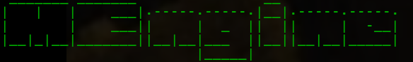
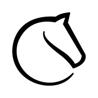

<div id="marcoengine-logo" align="center">
    <br/>
    
    <h2>Python chess neural network</h2>
</div>


<div id="badges" align="center">
    
[](https://www.python.org/)
    
[](https://github.com/WennMarcoRTX)
[](https://en.wikipedia.org/wiki/Universal_Chess_Interface)

[](https://github.com/MarcoNITE/MarcoEngine/actions/workflows/python-app.yml)
    
[](https://svgshare.com/i/Zhy.svg)
[](https://svgshare.com/i/ZhY.svg)
[](https://svgshare.com/i/ZjP.svg)
    
</div>
    

*Marco Engine* is an interesting neural chess network that uses a self-learning method (achieving a good game by trying out mistakes). 

# ↓ Installation

First, install the required *libraries*:

```bash
pip install -r requirements.txt
```

Wait for the modules to be installed. Now, you need to set the weights. You can find out more about this in the __Where I can download weights?__ section.

# 🚗 Start engine

To run the engine, you must have weights. If you don't have weights, you can create a `weights_norm.json` file in the __weights__ folder. After that, go to the main directory of the project, then write the command:

```bash
python3 train.py
```

After that, wait the amount of time you need, and turn off the program. Congratulations! You now have a working __MarcoEngine__ in your hands. Time to test it. The engine supports a small part of the __UCI__ protocol, but this is enough. To start the UCI shell:

```bash
python3 uci.py
```

# 🏗️ I want to build engine
If you need to compile the engine, you can use the __build.sh__ file. Just type in terminal:

```bash
bash build.sh
```

Then wait, and everything will be ready.

*IMPORTANT!!! The compilation is not yet fully tested, and there may be interruptions in work, for which we apologize ...*

# 🖥️ Where I can download weights?
You can get the weights in two ways: 
__1. Method 3:__ ~~Download from one of the releases of __MarcoEngine__ (they will be in this repository), then transfer the weights file to the `weights` folder. Next, read the text under the heading __Start engine__ to understand how to start the engine.~~(*not supported now*)

__2. Method 2:__ Train a neural network on a computer. If you want to generate weights directly on your computer, you can enter the command:

```bash
python3 train.py
```

Then wait some time for the training program to reach at least the first stage of weights. You can either continue the program to train, or just turn it off. After that, your path lies in the __Start engine__ header, where you will be shown how to start the engine.

__3. Method 3:__ Use a [special utility](https://github.com/MarcoNITE/MarcoEngine-weights-generator) to quickly generate weights. After the end of the generation, place the **.json** files in the **weights** folder.


# ⚙️ How does Marco Engine work?

Marco Engine is a completely different engine from other chess neural networks. It doesn't use any neurons, synapses, or anything like that. This engine is very simple, from its side, when the program starts, it looks like this:

1. Playing with yourself, writing the game in something like the __PGN__ format, but in *.json*: `{"move": "board fen"}`. After the game, it writes to the __results.json__ file (which is in the `games` directory) it writes the result of the game.

2. After that, it starts in a loop through the keys of the *json* dictionary in which the game is recorded. He analyzes the positions, and then reveals whether that move was a good one or not. If it is good, it writes a move to the *json* dictionary, and the iteration starts again. Otherwise - it starts analyzes the position more and more deeply, trying to find a new move. After finding a new move, he compares the estimates, after which he already receives an answer - is the new move good or not. Here I think it's understandable, he writes down this move in the weights, and the iteration starts again.

Very simple, but very productive. We improve our neural network almost every day, we hope that something good will come out.

# 📝 MarcoEngine UCI-protocol
| ***Command*** | go | uciok(AKA: uci) | ucinewgame | position fen [fen] | position startpos moves [moves] | isready | quit |
| :---: | :---: | :---: | :---: | :---: | :---: | :---: | :---: |
| ***About*** | Analyzing position | Gives about UCI settings | Starts new game with new board | Creates new board with inputed fen | Sets moves to new board | Hey! MEngine, you ready? | Exit from MarcoEngine |


<div id="contacts" align="center">
    <br/>
    <h1>📩 Contact us!</h1>
</div>

<div align="center">
    <a href="https://github.com/WennMarcoRTX">
        
    </a>
    
    <a href="https://lichess.org/@/ProshkaKartoshka">
        
    </a>
    

</div>
